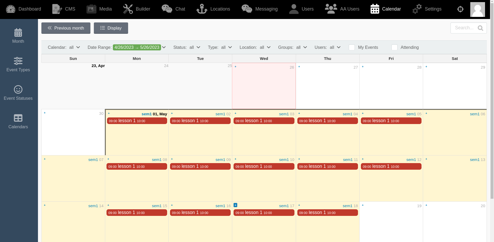
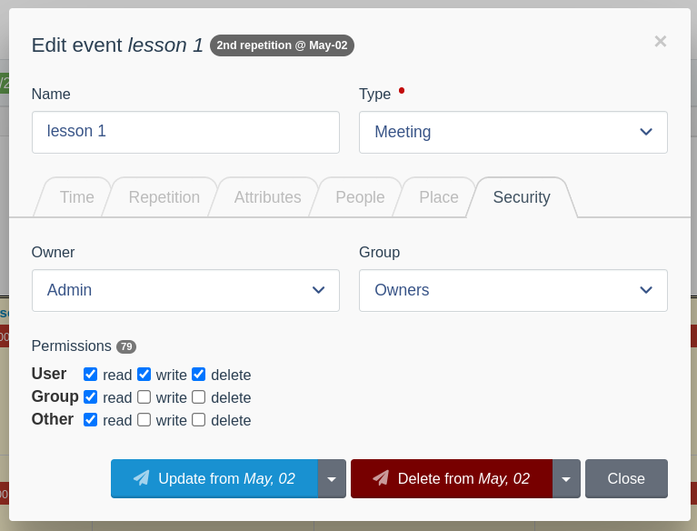

Google Calendar functional copy for the Winter CMS backend with, of course:
* infinite scroll, 
* drag-drop event update, 
* linux-style security (ugo rwd), 
* event attendees (users & groups), 
* configurable views (columns), 
* Auto-ICS synchronization,
* standard extensible Laravel Models including location,
* all-day events,
* container events (all repeating child events are contained within the container dates),
* and more

