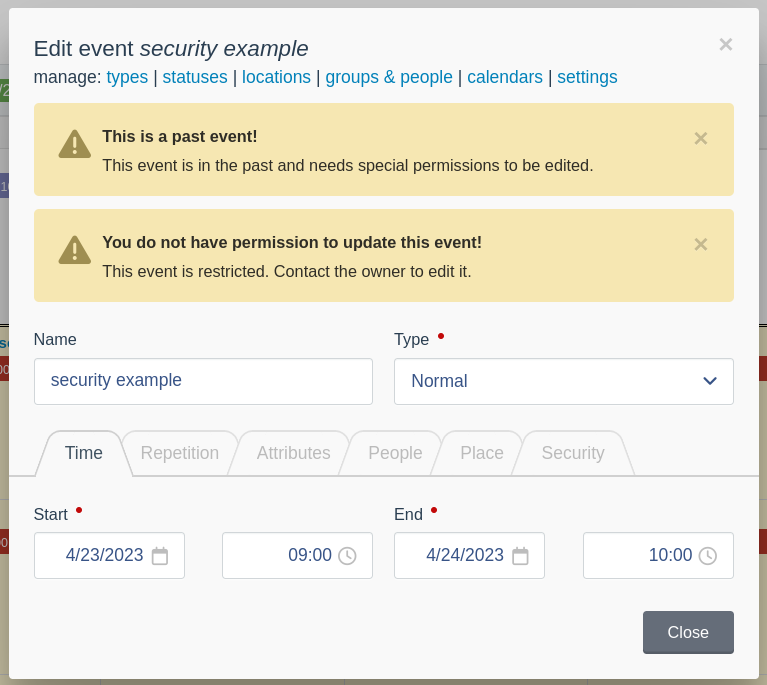
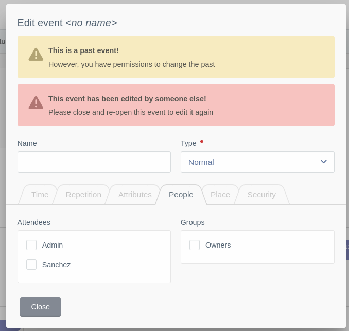

# Google Calendar functional copy
This plug-in only works with PostGreSQL and makes use of DB Triggers and special PG field types.
For the Winter CMS backend with, of course:

 * repeating events (daily, weekly, monthly, yearly) with frequency, date-until and day mask,
 * container events (all repeating child events are contained within the container dates),
 * update whole series, from now on, just this instance,
 * infinite scroll,
 * drag-drop event update,
 * linux-style security (ugo rwd),
 * event attendees (users & groups),
 * configurable views (columns),
 * auto-ICS synchronization,
 * standard extensible Laravel Models including location,
 * all-day events,
 * broadcasting (websockets) live update,
 * dirty-write protection (both dynamic CSS display and at point of saving),
 * event filtering (my events, attendance, etc.)
 * multiple calendars,
 * and more...

