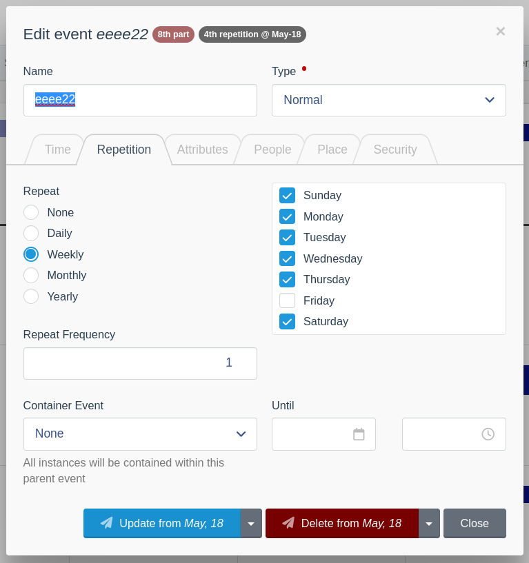
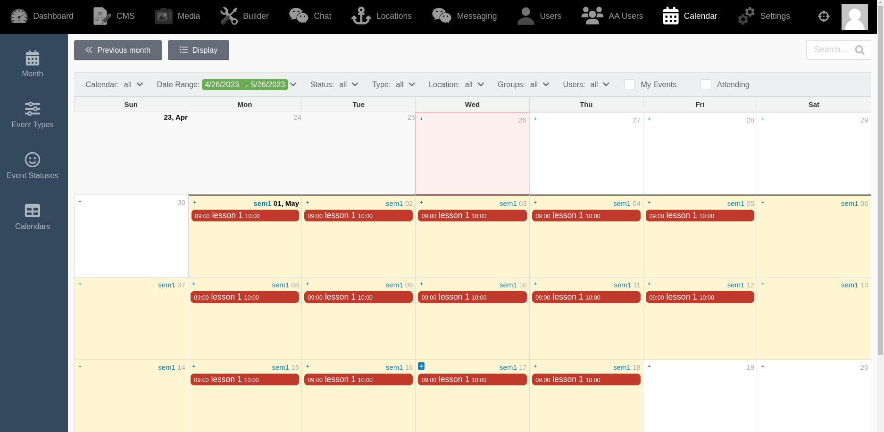
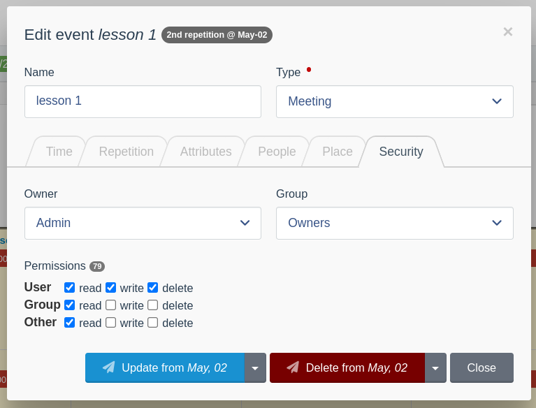
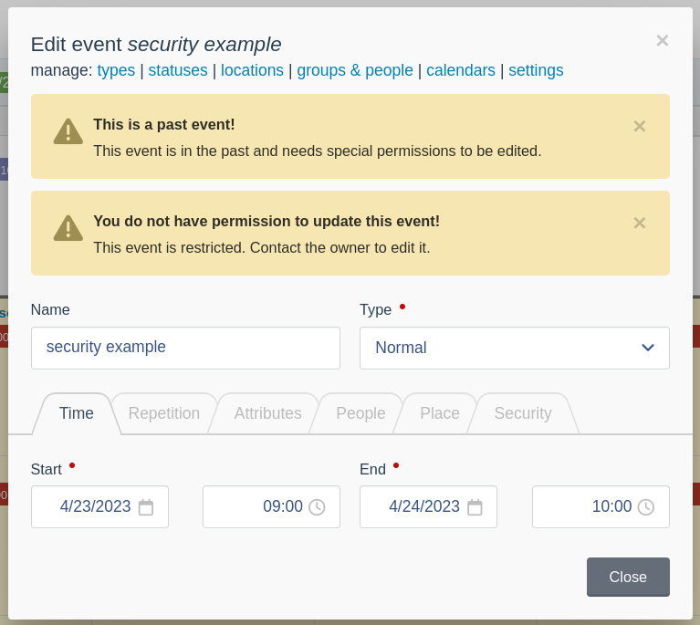
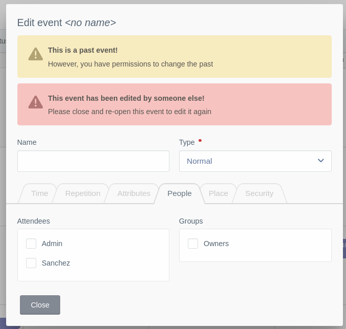

# Calendar — Google Calendar-style plugin for WinterCMS

> **Note:** CI development in progress: contains a full curl-based test-suite. Semgrep Security Scan used as CodeQL security scanning is unfortunately not available for PHP on GitHub's free tier.


[](https://github.com/anewholm/calendar/actions/workflows/ci.yml)
[](https://github.com/anewholm/calendar/actions/workflows/semgrep.yml) \(Full CI curl test suite in development...\)

A full-featured calendar plugin for the WinterCMS backend, modelled on Google Calendar. Built on PostgreSQL triggers and native interval/array types for a robust, super high-performance under load, with large data, server-enforced event model.

**Requires PostgreSQL 16+. MySQL is not supported** — PostgreSQL triggers and interval types are fundamental to the event model.







## Features

- **Repeating events** — daily, weekly, monthly, yearly with frequency multiplier, day mask, and `until` date
- **Container events** — parent event bounds all child repeating instances within a date range
- **Series editing** — update the whole series, from this instance forward, or just this occurrence
- **Infinite scroll** — navigate months without page reload
- **Drag-and-drop** — move or resize events; changes persist immediately
- **Linux-style permissions** — owner / group / other × read / write / delete per event
- **Attendees** — invite WinterCMS backend users or groups (requires [User plugin](https://github.com/anewholm/user))
- **Multiple calendars** — filter by calendar, user, attendance status
- **ICS synchronisation** — auto-generated `.ics` feeds, including repeating events and exceptions
- **Broadcasting** — live updates via WebSockets when another user edits a shared event
- **Dirty-write protection** — events lock visually and at save when concurrently edited
- **All-day events** — full-day flag supported
- **Optional integrations** — Location ([location plugin](https://github.com/anewholm/location)), Messaging ([messaging plugin](https://github.com/anewholm/messaging))

## Compatibility

| WinterCMS | Laravel | PHP  | PostgreSQL |
|-----------|---------|------|------------|
| 1.2.0     | 9       | 8.1+ | 12+        |
| 1.2.x     | 10      | 8.1+ | 12+        |
| 1.2.x     | 11      | 8.2+ | 12+        |

## Prerequisites

- WinterCMS 1.2+ installed
- [Acorn module](https://github.com/anewholm/acorn) installed as `modules/acorn`
- PostgreSQL 16+

## Installation

1. Clone this repository into `plugins/acorn/calendar` inside your WinterCMS root:
   ```bash
   mkdir -p plugins/acorn
   git clone https://github.com/anewholm/calendar plugins/acorn/calendar
   ```

2. Clone the Acorn dependency into `modules/acorn`:
   ```bash
   git clone https://github.com/anewholm/acorn modules/acorn
   ```

3. Add the Acorn module to `config/cms.php`:
   ```php
   'loadModules' => ['System', 'Backend', 'Cms', 'Acorn'],
   ```

4. Run migrations:
   ```bash
   php artisan winter:up
   ```

5. The Calendar section appears in the WinterCMS backend sidebar.

## Known limitations

- PostgreSQL only — no MySQL support.
- Broadcasting requires a configured WebSocket server (e.g. Laravel Echo Server or Soketi).
- Attendee features require the [User plugin](https://github.com/anewholm/user).
- Location features require the [Location plugin](https://github.com/anewholm/location).

## Architecture

Due to the complexities and processing requirements to project the many types of event repitition, Calendar uses 2 tables: `acorn_calendar_event_parts` for event details including repeation type & settings, and `acorn_calendar_instance` for the multiple event instances, keyed by date. For example, an event that repeats weekly for 1 year will have 1 row `acorn_calendar_event_parts` and 52 rows in `acorn_calendar_instance`. All time-based querying is on the `acorn_calendar_instance` primarily. Un-bounded repetition is future, and past, projected limited to the repetition window settings.

Events can have many parts, thus containing a changing event setup over time in to 1 manageable event. For example, an event that changes its repetition frequency from weekly to daily after 1 month would still be 1 event, in `acorn_calendar_events`, but 2 parts in `acorn_calendar_event_parts` with a different repetition setting. Titles, descriptions and so on are all stored at the `acorn_calendar_event_parts` level, thus allowing great flexibility during an event lifetime.

## License

MIT
